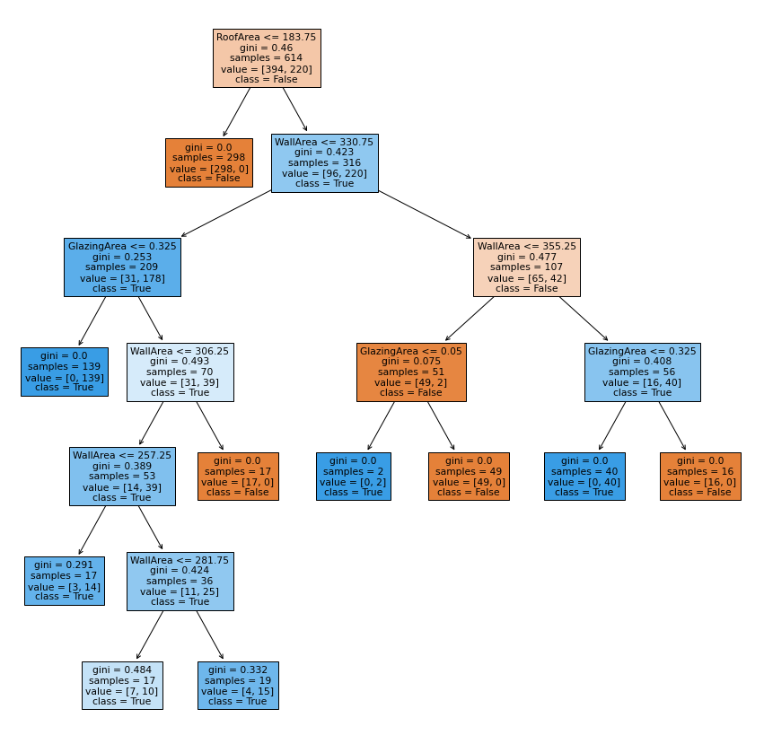

# energy_efficiency

Decision Tree performed the best <br>
Train accuracy: 0.98 <br>
Test accuracy: 0.99 <br>



Make sure you have Flask and numpy installed:

```
pip install Flask numpy
```

Run Flask app:

```
python app.py
```

Use POST method to send data as JSON:

```
{
	"Glazing_Area": 0.0,
	"Wall_Area": 294.0,
	"Roof_Area": 380.25
}
```
